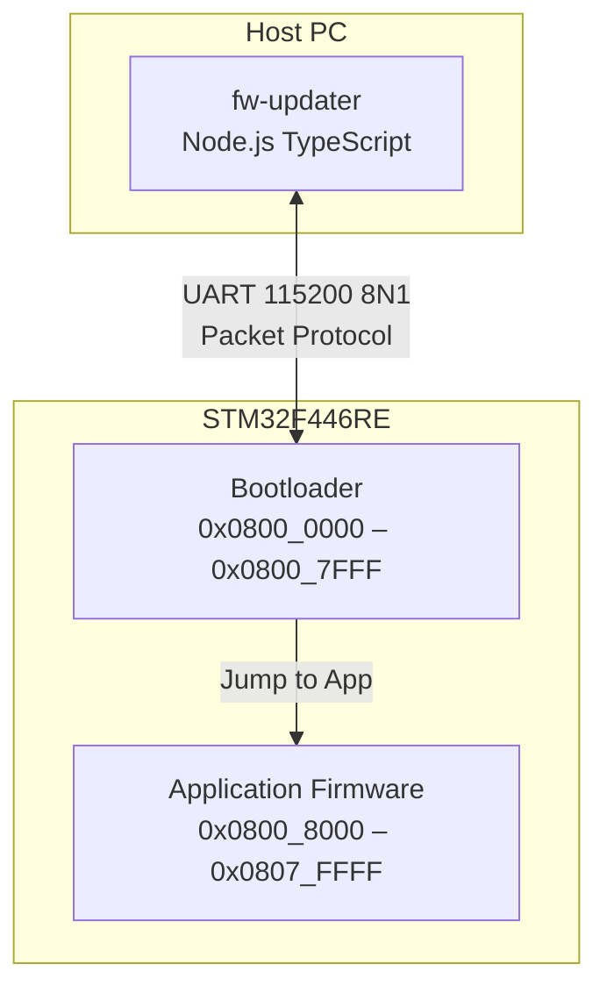
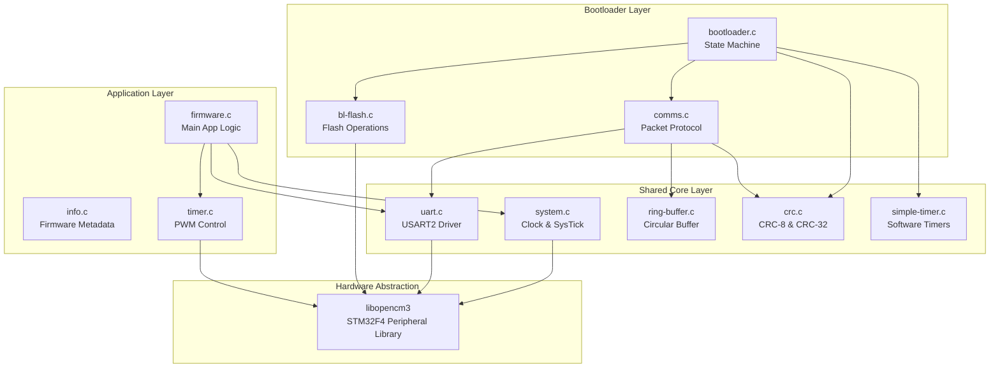
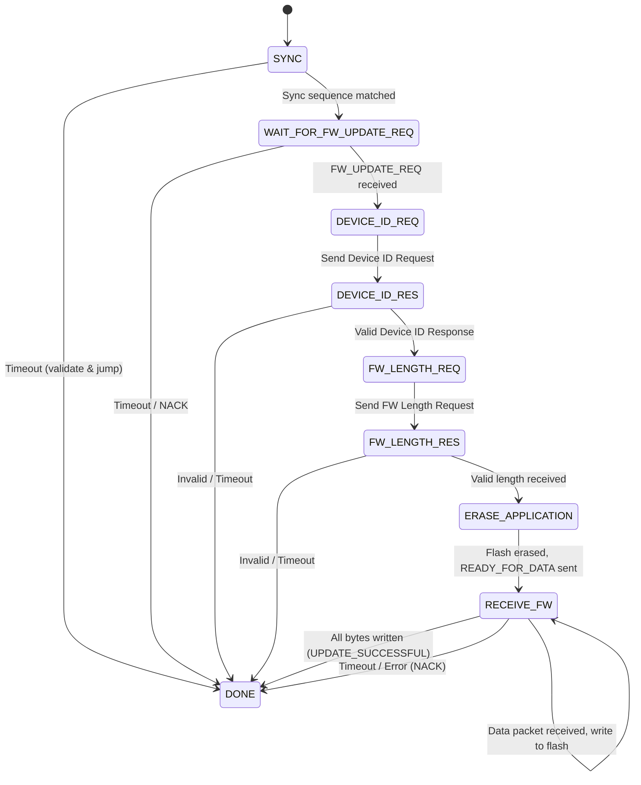
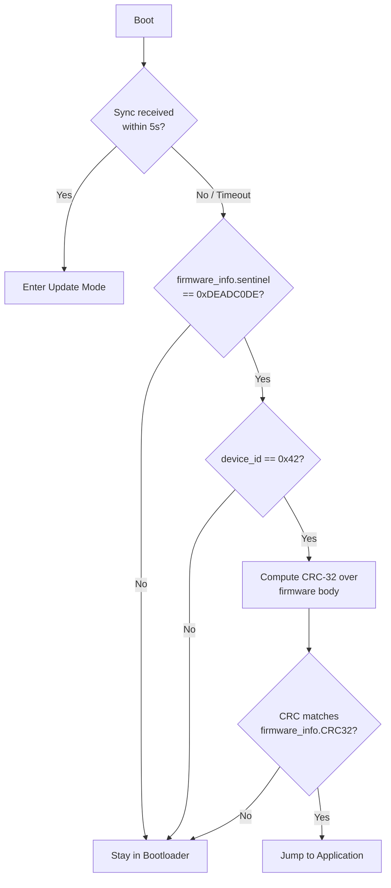
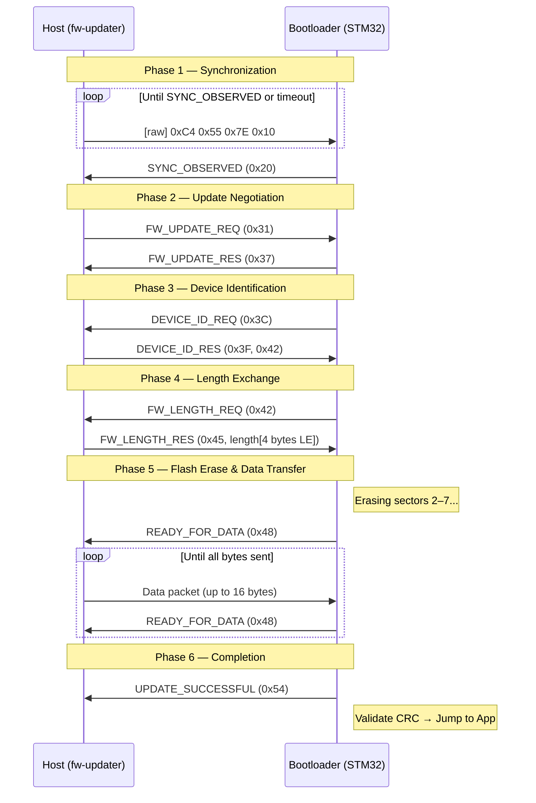

# STM32F446RE Bare-Metal Bootloader & Firmware System — Technical Documentation

## Table of Contents

1. [System Overview](#system-overview)
2. [Architecture](#architecture)
3. [Memory Map](#memory-map)
4. [Component Details](#component-details)
5. [Communication Protocol](#communication-protocol)
6. [Firmware Update Process](#firmware-update-process)
7. [Build System](#build-system)
8. [Directory Structure](#directory-structure)

---

## System Overview

This project implements a custom bare-metal bootloader and application firmware for the **STM32F446RE** (ARM Cortex-M4) microcontroller on a Nucleo-F446RE board. The system uses the **libopencm3** open-source firmware library instead of vendor HAL.

Key capabilities:
- Custom UART-based bootloader with firmware update over serial (115200 baud)
- CRC-32 firmware integrity validation
- Firmware metadata embedding (version, device ID, CRC)
- Host-side Node.js/TypeScript firmware updater tool
- PWM LED fading demo application

---

## Architecture

### High-Level System Architecture



### Software Layer Architecture



---

## Memory Map

| Region | Start Address | End Address | Size | Contents |
|--------|--------------|-------------|------|----------|
| Bootloader ROM | `0x0800_0000` | `0x0800_7FFF` | 32 KB | Bootloader code + vector table |
| Application ROM | `0x0800_8000` | `0x0807_FFFF` | 480 KB | App vector table + firmware_info + app code |
| RAM | `0x2000_0000` | `0x2001_FFFF` | 128 KB | Stack, heap, .data, .bss |

### Application Flash Layout (starting at `0x0800_8000`)

```
+---------------------------------------------+
| Bootloader Binary (padded to 32KB with 0xFF)|  ← .bootloader_section (incbin)
+---------------------------------------------+
| Application Vector Table (0x1AC bytes)      |  ← .vectors
+---------------------------------------------+
| firmware_info_t struct (36 bytes)           |  ← .firmware_info section
+---------------------------------------------+
| Application Code & Read-Only Data           |  ← .text, .rodata
+---------------------------------------------+
```

### `firmware_info_t` Structure

```c
typedef struct firmware_info_t {
    uint32_t sentinel;          // 0xDEADC0DE — magic marker
    uint32_t device_id;         // 0x42
    uint32_t firmware_version;  // e.g. 0x00010000 = v1.0.0
    uint32_t length;            // Total firmware image length (bytes)
    uint32_t reserved[4];       // Reserved for future use
    uint32_t CRC32;             // CRC-32 over code after firmware_info
} firmware_info_t;
```

---

## Component Details

### Bootloader (`bootloader/`)

The bootloader occupies the first 32 KB of flash. On reset it:
1. Initializes system clock (84 MHz via HSI PLL), GPIO, UART, and comms
2. Waits up to 5 seconds for a sync sequence from the host
3. If sync received → enters firmware update state machine
4. If timeout expires with no sync → validates existing firmware via CRC-32 and jumps to app
5. After successful update → jumps to app

#### Bootloader State Machine



#### Firmware Validation (on boot without update)



#### Jump to Application

```c
// Set VTOR to application vector table
// Read reset vector from app's vector table (offset +4)
// Cast to function pointer and call
```

### Application Firmware (`app/`)

- Sets `SCB_VTOR = 0x8000` to relocate the vector table
- Configures TIM2 CH1 in PWM mode on PA5 (onboard LED)
- Fades LED by incrementing duty cycle 1% every 10 ms
- Echoes received UART bytes back to host

### Shared Core Library (`shared/`)

| Module | Purpose |
|--------|---------|
| `system.c` | RCC PLL config (84 MHz HSI), SysTick @ 1 kHz, tick counter |
| `uart.c` | USART2 driver with interrupt-driven RX via ring buffer |
| `ring-buffer.c` | Power-of-2 circular buffer with mask-based wrapping |
| `crc.c` | Software CRC-8 (poly 0x07) and CRC-32 (poly 0xEDB88320) |
| `simple-timer.c` | Tick-based software timers (one-shot and periodic) |

### Firmware Updater (`fw-updater/`)

A Node.js TypeScript CLI tool that:
1. Reads the combined `firmware.bin` from disk
2. Slices off the 32 KB bootloader prefix
3. Injects firmware length, version, and computed CRC-32 into the `firmware_info` section
4. Sends sync sequence over UART
5. Executes the full update protocol handshake
6. Streams firmware in 16-byte packets with CRC-8 integrity

---

## Communication Protocol

### Packet Format (18 bytes fixed)

```
┌──────────┬────────────────────────────┬──────────┐
│ Length   │ Data (16 bytes, 0xFF pad)  │ CRC-8    │
│ (1 byte) │                            │ (1 byte) │
└──────────┴────────────────────────────┴──────────┘
```

- **Length**: Number of meaningful payload bytes (1–16)
- **Data**: Payload left-aligned, unused bytes filled with `0xFF`
- **CRC-8**: Polynomial `x^8 + x^2 + x + 1` (0x07), computed over length + data

### Control Packets

| Packet | data[0] | Purpose |
|--------|---------|---------|
| ACK | `0x15` | Acknowledge valid packet receipt |
| RETX | `0x19` | Request retransmission of last packet |
| SYNC_OBSERVED | `0x20` | Bootloader confirms sync sequence |
| FW_UPDATE_REQ | `0x31` | Host requests firmware update |
| FW_UPDATE_RES | `0x37` | Bootloader accepts update request |
| DEVICE_ID_REQ | `0x3C` | Bootloader requests device ID |
| DEVICE_ID_RES | `0x3F` | Host responds with device ID |
| FW_LENGTH_REQ | `0x42` | Bootloader requests firmware length |
| FW_LENGTH_RES | `0x45` | Host responds with 4-byte length (LE) |
| READY_FOR_DATA | `0x48` | Bootloader ready for next data chunk |
| UPDATE_SUCCESSFUL | `0x54` | Firmware update completed |
| NACK | `0x59` | Protocol error, update aborted |

### Sync Sequence (raw bytes, not packetized)

```
0xC4  0x55  0x7E  0x10
```

Sent repeatedly by the host until the bootloader responds with `SYNC_OBSERVED`.

### Error Handling

- CRC mismatch → receiver sends RETX, sender retransmits last packet
- Timeout (5s default) at any state → bootloader sends NACK and aborts
- Invalid device ID or firmware length exceeding `MAX_FW_LENGTH` → NACK

---

## Firmware Update Process

### End-to-End Sequence Diagram



---

## Build System

### Prerequisites

- `arm-none-eabi-gcc` toolchain
- `make`
- Python 3 (for libopencm3 code generation and bootloader padding)
- Node.js + npm (for fw-updater)
- J-Link tools (for power control tasks)

### Build Commands

| Task | Command | Description |
|------|---------|-------------|
| Build libopencm3 | `make` in `libopencm3/` | Compile peripheral library (one-time) |
| Build bootloader | `make bin` in `bootloader/` | Produces `bootloader.bin` + `bootloader.elf` |
| Pad bootloader | `python3 bootloaderPadding.py` in `bootloader/` | Pads to exactly 32 KB with 0xFF |
| Build application | `make bin` in `app/` | Produces `firmware.bin` (includes bootloader via `.incbin`) |
| Run updater | `npx ts-node index.ts` in `fw-updater/` | Flashes firmware over UART |

### Build Flow


### Compiler Flags

- **Target**: `-mthumb -mcpu=cortex-m4 -mfloat-abi=hard -mfpu=fpv4-sp-d16`
- **Optimization**: `-Os` (size-optimized)
- **Standard**: `-std=c99`
- **Linker**: `--static -nostartfiles -Wl,--gc-sections`

---

## Directory Structure

```
bare-metal/
├── Plan.md                     # Project planning notes
├── DOCUMENTATION.md            # This file
├── bootloader/                 # Bootloader firmware
│   ├── Makefile                # Build rules
│   ├── linkerscript.ld         # ROM: 32KB at 0x08000000
│   ├── bootloaderPadding.py    # Pads binary to 32KB
│   ├── inc/
│   │   ├── bl-flash.h          # Flash erase/write API
│   │   ├── comms.h             # Packet protocol definitions
│   │   └── common-defines.h    # stdint/stdbool includes
│   └── src/
│       ├── bootloader.c        # Main bootloader state machine
│       ├── comms.c             # Packet TX/RX with CRC & retransmit
│       └── bl-flash.c          # STM32 flash sector erase & program
├── app/                        # Application firmware
│   ├── Makefile                # Build rules
│   ├── linkerscript.ld         # ROM: 512KB, custom sections
│   ├── inc/
│   │   ├── common-defines.h
│   │   └── timer.h             # PWM timer API
│   └── src/
│       ├── bootloader.S        # .incbin of padded bootloader binary
│       └── core/
│           ├── firmware.c      # Main app (LED PWM fade + UART echo)
│           ├── info.c          # firmware_info_t instance (.firmware_info section)
│           └── timer.c         # TIM2 PWM setup
├── shared/                     # Code shared between bootloader & app
│   ├── inc/core/
│   │   ├── crc.h
│   │   ├── firmware-info.h     # firmware_info_t definition & address macros
│   │   ├── ring-buffer.h
│   │   ├── simple-timer.h
│   │   ├── system.h
│   │   └── uart.h
│   └── src/core/
│       ├── crc.c               # CRC-8 and CRC-32 implementations
│       ├── ring-buffer.c       # Power-of-2 circular buffer
│       ├── simple-timer.c      # Software timer (one-shot & periodic)
│       ├── system.c            # Clock (84MHz), SysTick (1kHz)
│       └── uart.c              # USART2 ISR-driven RX with ring buffer
├── fw-updater/                 # Host-side firmware update tool
│   ├── index.ts                # Main updater script (TypeScript)
│   ├── package.json
│   └── tsconfig.json
└── libopencm3/                 # Peripheral library (git submodule)
```

---

## Hardware Configuration

| Peripheral | Configuration | Purpose |
|-----------|---------------|---------|
| RCC | HSI → PLL → 84 MHz SYSCLK | System clock |
| SysTick | 1 kHz interrupt | Millisecond tick counter |
| USART2 | 115200 8N1, PA2(TX)/PA3(RX), AF7, IRQ-driven RX | Serial comms |
| TIM2 CH1 | PWM1 mode, PSC=83, ARR=999 → 1 kHz PWM on PA5 | LED brightness |
| FLASH | Sectors 2–7, 32-bit parallel programming | Firmware storage |
| GPIOA | PA5 AF1 (TIM2), PA2/PA3 AF7 (USART2) | Peripherals |

---

## Security & Integrity

- **CRC-32 firmware validation**: Bootloader computes CRC-32 over the entire firmware body (excluding vector table and firmware_info struct) before jumping to the application
- **Device ID check**: Bootloader verifies the firmware image's embedded device ID matches the expected value (`0x42`) before accepting an update
- **Sentinel marker**: `0xDEADC0DE` identifies a valid firmware_info struct presence
- **Per-packet CRC-8**: Every 18-byte packet on the wire is protected against corruption with automatic retransmission
- **Length validation**: Firmware size must not exceed `MAX_FW_LENGTH` (224 KB)

---

## Key Design Decisions

1. **Fixed-length packets (18 bytes)**: Simplifies framing — no start/stop delimiters or escape sequences needed
2. **Bootloader padding to 32 KB**: Ensures the application always starts at a fixed, known address regardless of bootloader code size
3. **Bootloader embedded in app binary**: The combined `firmware.bin` contains both bootloader and app via `.incbin`, enabling full-device reflash from a single file
4. **libopencm3 over STM32 HAL**: Lighter-weight, more transparent hardware access suitable for bare-metal development
5. **Shared code library**: Common modules (UART, CRC, timers) compiled into both bootloader and app without duplication of source files
