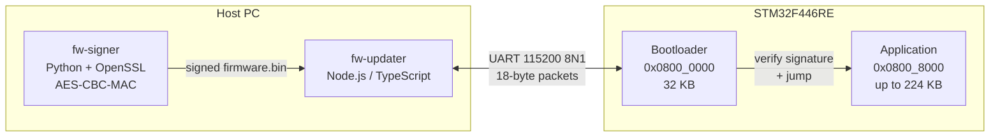
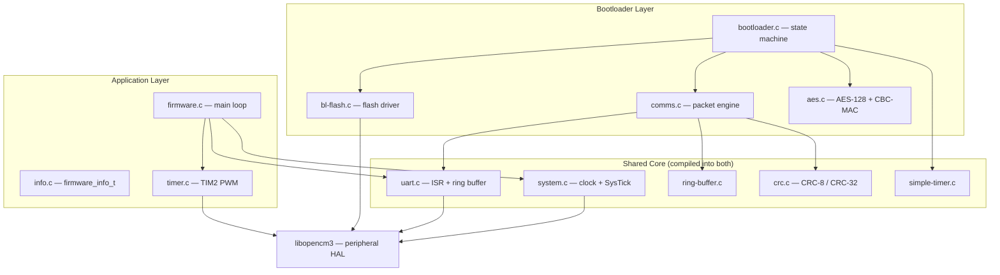
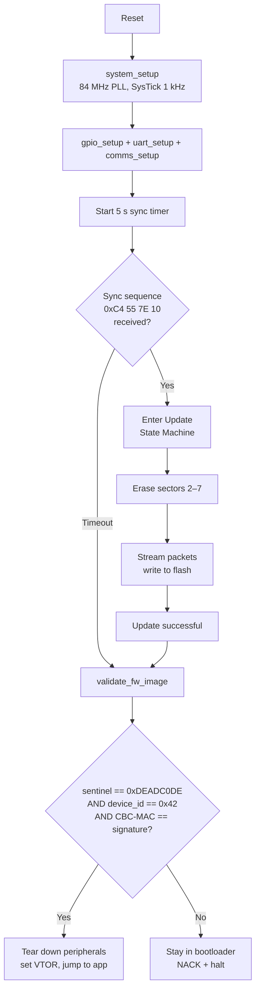
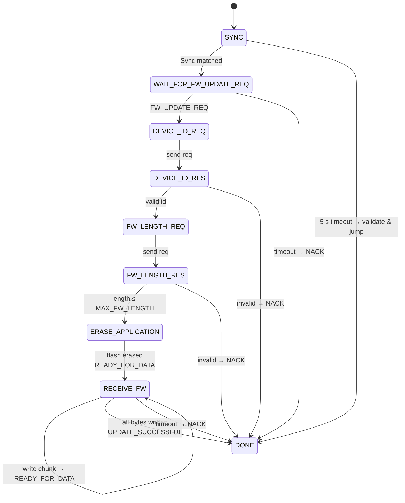
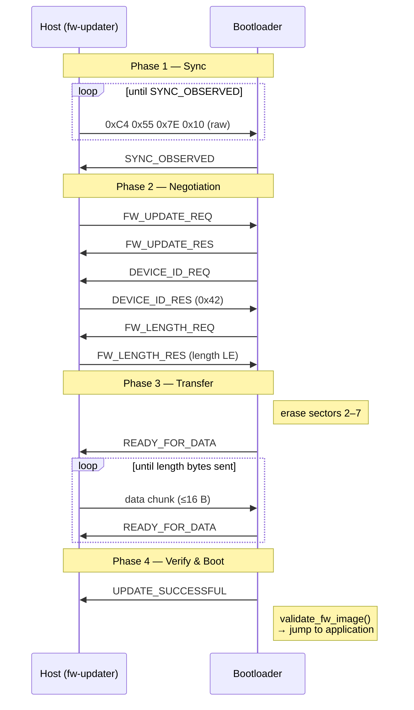
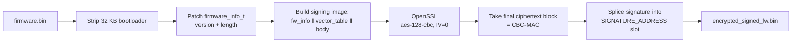
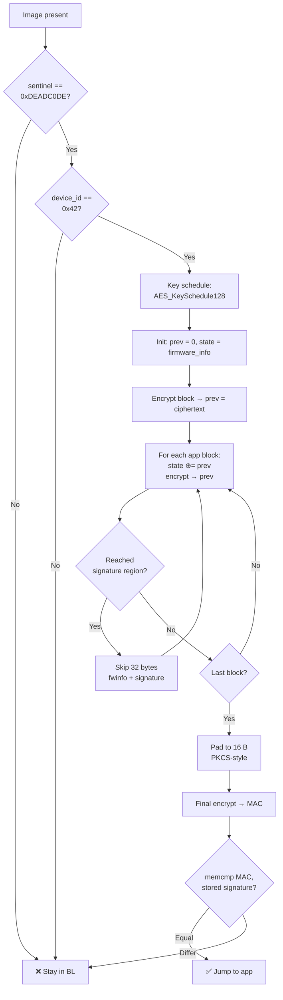

# STM32F446RE Secure Bare-Metal Bootloader & Firmware Update System

A production-style **secure bootloader**, **application firmware**, and **host-side update toolchain** for the STM32F446RE (ARM Cortex-M4) — written from scratch in C, without any vendor HAL, using only the open-source [libopencm3](https://github.com/libopencm3/libopencm3) peripheral library.

The system implements a complete **Over-The-Wire firmware update pipeline** with:

- A custom fixed-length, CRC-protected serial packet protocol with automatic retransmission
- **AES-128 CBC-MAC** image authentication (cryptographic signature, not just a CRC)
- A reproducible build that produces a **single combined binary** (bootloader + app) that is field-flashable
- A Python firmware-signer and a TypeScript host-side updater

It is intentionally bare-metal: there is no RTOS, no dynamic memory, no third-party crypto library — every layer is implemented by hand to demonstrate end-to-end systems engineering.

---

## Table of Contents

1. [Highlights](#highlights)
2. [System Architecture](#system-architecture)
3. [Memory Map](#memory-map)
4. [Boot Flow](#boot-flow)
5. [Firmware Update Protocol](#firmware-update-protocol)
6. [Cryptographic Design (AES-128 CBC-MAC)](#cryptographic-design-aes-128-cbc-mac)
7. [Repository Layout](#repository-layout)
8. [Build & Run](#build--run)
9. [Engineering Decisions — Why?](#engineering-decisions--why)
10. [Future Enhancements](#future-enhancements)
11. [Tech Stack](#tech-stack)

---

## Highlights

| Area | What was built |
|---|---|
| **Embedded C** | Bootloader + application firmware on STM32F446RE (Cortex-M4F, 84 MHz) |
| **Communications** | Interrupt-driven USART2 driver, ring-buffer RX, fixed 18-byte packet protocol with CRC-8 + RETX/ACK |
| **Flash programming** | Sector-aware erase/program of STM32 flash sectors 2–7 with 32-bit parallelism |
| **Cryptography** | Hand-rolled AES-128 (S-box, MixColumns, key schedule) + CBC-MAC image authentication |
| **Build system** | GCC/Make with auto-dependency tracking, linker script with custom sections, `.incbin` to embed bootloader inside the app image |
| **Tooling** | Python firmware-signer (OpenSSL CBC-MAC), TypeScript/Node.js OTA updater, J-Link power tasks |
| **Reliability** | Per-packet CRC-8, image-level CBC-MAC, sentinel + device-ID gating, 5 s state-timeouts, 0xFF flash padding |

---

## System Architecture

### High-level



### Software layers



---

## Memory Map

| Region | Address Range | Size | Contents |
|---|---|---|---|
| Bootloader | `0x0800_0000 – 0x0800_7FFF` | 32 KB | Vector table + bootloader code (padded to 32 KB with `0xFF`) |
| Application | `0x0800_8000 – 0x0803_FFFF` | up to 224 KB | App vector table + `firmware_info_t` + signature + code |
| RAM | `0x2000_0000 – 0x2001_FFFF` | 128 KB | Stack, `.data`, `.bss` |

### Application image layout

```
0x0800_8000 ┌────────────────────────────────────┐
            │ Application Vector Table (0x1B0)   │ ← 16-byte aligned
0x0800_81B0 ├────────────────────────────────────┤
            │ firmware_info_t (sentinel,         │
            │   device_id, version, length)      │ ← 1st AES block (authenticated)
0x0800_81C0 ├────────────────────────────────────┤
            │ AES-128 CBC-MAC Signature (16 B)   │ ← skipped during MAC computation
0x0800_81D0 ├────────────────────────────────────┤
            │ .text  /  .rodata                  │
            │ ...                                │
            └────────────────────────────────────┘
```

The bootloader is **embedded inside the application binary** via a GNU `.incbin` directive in [bootloader.S](app/src/bootloader.S), so the deployed `firmware.bin` is one contiguous image that can reflash a virgin device end-to-end.

---

## Boot Flow



### Bootloader state machine



---

## Firmware Update Protocol

### Wire format (fixed 18 bytes)


```
┌──────────┬─────────────────────────────┬──────────┐
│ Length   │ Data (16 bytes, 0xFF pad)   │ CRC-8    │
│ (1 byte) │                             │ (1 byte) │
└──────────┴─────────────────────────────┴──────────┘
```

- **CRC-8** polynomial `0x07` (CRC-8/SMBUS), computed over `[length || data]`.
- **Fixed length** removes the need for byte-stuffing or framing delimiters.
- On corruption, the receiver replies with `RETX (0x19)`; the sender re-emits its **last raw buffer** verbatim.

### Control bytes

| Byte | Meaning |
|---|---|
| `0x15` | ACK |
| `0x19` | RETX (retransmit last) |
| `0x20` | SYNC_OBSERVED |
| `0x31 / 0x37` | FW update request / response |
| `0x3C / 0x3F` | Device-ID request / response |
| `0x42 / 0x45` | FW length request / response (4 bytes LE) |
| `0x48` | READY_FOR_DATA |
| `0x54` | UPDATE_SUCCESSFUL |
| `0x59` | NACK |

### End-to-end sequence



---

## Cryptographic Design (AES-128 CBC-MAC)

The bootloader does **not trust** an image just because its CRC matches — a CRC only protects against accidental corruption, not tampering. Authentication uses a hand-rolled **AES-128 in CBC-MAC** mode.

### Signing flow (host side — [`fw-signer/main.py`](fw-signer/main.py))



> Why reorder the blocks?  Putting `firmware_info` **first** in the MAC input cryptographically binds the version and length fields to the signature — an attacker cannot truncate, downgrade, or roll back the image without invalidating the MAC.

### Verification flow (device side — [`bootloader.c::validate_fw_image`](bootloader/src/bootloader.c))



### AES-128 implementation

The AES core lives in [`bootloader/src/aes.c`](bootloader/src/aes.c) and implements:

| Primitive | Notes |
|---|---|
| `GF_Mult` | Galois-field $\mathrm{GF}(2^8)$ multiplication using shift-and-XOR with `0x1B` reduction polynomial |
| `AES_KeySchedule128` | 11 round keys via `RotWord` + `SubWord` + `Rcon` |
| `AES_SubBytes` / `ShiftRows` / `MixColumns` | Standard FIPS-197 round operations |
| `AES_EncryptBlock` | 10-round AES-128 |
| `aes_cbc_mac_step` | XOR with previous ciphertext, encrypt in place, save as new IV |

Key (`secrete_key`) is currently a hard-coded constant — see *Future Enhancements* for hardening (OTP / PUF / encrypted key blob).

---

## Repository Layout

```
bare-metal/
├── bootloader/         # Stage-1 bootloader (32 KB)
│   ├── src/{bootloader,comms,bl-flash,aes}.c
│   ├── linkerscript.ld
│   └── bootloaderPadding.py     # Pads to exact 32 KB
├── app/                # Application firmware
│   ├── src/core/{firmware,info,timer}.c
│   ├── src/bootloader.S         # .incbin of padded bootloader
│   └── linkerscript.ld          # Custom .firmware_info section
├── shared/             # Code compiled into BOTH bootloader & app
│   └── src/core/{system,uart,ring-buffer,crc,simple-timer}.c
├── fw-signer/          # Python AES-CBC-MAC signer
├── fw-updater/         # Node.js + TypeScript OTA host tool
├── libopencm3/         # Peripheral library (submodule)
└── DOCUMENTATION.md    # Deep-dive technical doc
```

---

## Build & Run

### Prerequisites

- `arm-none-eabi-gcc` toolchain
- GNU `make`, Python 3, OpenSSL on PATH
- Node.js ≥ 18 + `ts-node`
- J-Link tools (for `power_on` / `power_off` VS Code tasks)

### Build pipeline


```powershell
# 1. one-time
cd libopencm3 ; make
# 2. each release
cd ../bootloader ; make bin ; python bootloaderPadding.py
cd ../app        ; make bin
cd ../fw-signer  ; py main.py ../app/firmware.bin 0x01020304
cd ../fw-updater ; npx ts-node index.ts ../fw-signer/encrypted_signed_fw.bin
```

VS Code tasks (`power_on`, `build_bootloader`, `build_debug`, `pad_bootloader`, `build_libopencm3`) automate the same steps.

---

## Engineering Decisions — Why?

| Decision | Rationale |
|---|---|
| **libopencm3 instead of STM32 HAL** | Smaller, transparent, MIT/LGPL — no opaque “Cube” code. Lets the project stay genuinely bare-metal and portable across STM32 families. |
| **Fixed 18-byte packets** | Removes the need for SLIP/COBS framing or escape sequences; receiver just counts bytes — robust against partial reads on UART. |
| **CRC-8 per-packet + AES-CBC-MAC per-image** | Two-tier integrity: cheap line-noise detection per packet, cryptographic authentication of the whole image. |
| **CBC-MAC over `firmware_info` + body** | Binds the version & length to the MAC so an attacker cannot strip metadata or roll back versions undetected. |
| **Bootloader padded to exact 32 KB & embedded via `.incbin`** | The application image is self-contained — one binary reflashes everything, and the app vector table is always at a fixed `0x08008000`. |
| **Shared `core/` compiled into both binaries** | Single source of truth for UART, CRC, timers — no copy-paste drift between bootloader and app. |
| **Interrupt-driven UART RX + ring buffer** | Lets the main loop run a state-machine without polling — packets are reassembled lazily from a power-of-two ring buffer (mask, no modulo). |
| **Software timers on top of SysTick** | Avoids burning a hardware timer for protocol timeouts; one 1 kHz SysTick drives N independent `simple_timer_t` instances. |
| **State-machine bootloader (no RTOS)** | Deterministic, auditable, fits in 32 KB; every state has a 5 s watchdog so a hung host cannot brick the device. |
| **GPIO/clock teardown before app jump** | Application starts from a clean peripheral state, identical to a hardware reset, avoiding leaks of bootloader state. |

---

## Future Enhancements

The following list captures the natural roadmap for turning this into a production-grade IoT bootloader.

### 🔐 Security hardening
- **Replace hard-coded AES key** with a key derived at provisioning time and stored in:
  - STM32 OTP (one-time-programmable) bytes, **or**
  - Read-protected (RDP Level 2) flash, **or**
  - a small key-blob encrypted by an MCU UID-derived KEK.
- **Move from CBC-MAC to authenticated encryption (AES-GCM or AES-CCM)** so the firmware is *encrypted in flight* as well as authenticated.
- Migrate to **public-key signatures (Ed25519 / ECDSA-P256)** so the device only needs the public key — losing a device no longer leaks the signing key.
- Enable **STM32 RDP Level 2** + **PCROP / WRP** to lock the bootloader sectors against external readout and accidental erase.
- **Secure-boot rollback protection**: a monotonic version counter in OTP, refused-if-lower at validation time.
- Constant-time `memcmp` on signature comparison to defeat timing side-channels.

### 🚀 Performance & functionality
- **A/B (dual-bank) update slots** with atomic switch-over and automatic rollback if the new image fails to confirm boot — eliminates the “brick window” during update.
- **Compressed firmware transport** (heatshrink / miniz) — UART at 115 200 baud is the bottleneck.
- **Higher-throughput transports**: USB CDC-ACM, CAN-FD, or a tiny TFTP-over-Ethernet client.
- **DMA-driven UART** TX/RX to free the CPU during the multi-minute flash phase.
- **Hardware CRC** peripheral instead of software CRC-32 (already wired in libopencm3).
- **Hardware AES** peripheral on STM32 parts that ship one (STM32L4/U5/H5) — the software AES is portable but slow.

### 🛠️ Tooling & developer experience
- A unified **`Makefile` at repo root** orchestrating libopencm3 → bootloader → app → signer → updater (one `make release`).
- Replace `ts-node` with a **compiled CLI** (`pkg` or Bun single-file binary) so end users don’t need a Node toolchain.
- Add **`--port` / `--key` / `--version` CLI flags** to the updater (currently hard-coded to `COM6`).
- **Progress bar + throughput metric** in the updater for better UX during long flashes.
- **CI pipeline** (GitHub Actions): cross-build with `arm-none-eabi-gcc`, run unit tests on the host code, sign a dummy image, lint TypeScript & Python.
- **Static analysis**: `cppcheck`, `clang-tidy`, MISRA-C subset, `-Werror` in CI.
- **Unit tests** for `crc.c`, `ring-buffer.c`, and `aes.c` (with the FIPS-197 test vectors) compiled natively for the host.
- **Renode / QEMU simulation** so the bootloader can be exercised in CI without hardware.

### 📦 Robustness
- **Watchdog (IWDG)** kicked from the main loop — recover automatically if the bootloader state machine wedges.
- **Power-loss safety**: write a “update-in-progress” flag to a backup flash sector so an interrupted update is detected on next boot and reattempted instead of bricking.
- **Version downgrade policy** + version metadata signed inside the MAC.
- **Multi-image manifest** (bootloader self-update, optional secondary MCU images, etc.).
- Replace the magic 5 s state-timeout with a **handshaked keep-alive** so slow links don’t spuriously NACK.

### 📚 Project polish
- Public **API doxygen** for `shared/core/`.
- Hardware test report + oscilloscope captures of the UART exchange.
- Architecture Decision Records (ADRs) in `docs/adr/`.
- Demo GIF of the OTA flash in the README.

---

## Tech Stack

**Embedded:** C99 · ARM Cortex-M4F · libopencm3 · GCC (arm-none-eabi) · GNU ld · GNU Make
**Host tooling:** Python 3 · OpenSSL · Node.js · TypeScript · `serialport`
**Hardware:** ST Nucleo-F446RE · J-Link / ST-Link · USB-to-UART
**Concepts demonstrated:** linker scripts · custom sections · `.incbin` · interrupt-driven I/O · ring buffers · finite-state machines · CRC algorithms · AES-128 from scratch · CBC-MAC · secure boot · OTA firmware update

---

> See [`DOCUMENTATION.md`](DOCUMENTATION.md) for the full technical deep-dive, including peripheral configuration tables and per-file walkthroughs.
